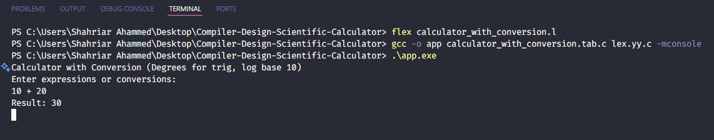

# 🧮 Scientific Calculator (Compiler Design Project)


> A lightweight command-line scientific calculator implemented in C using **Flex** and **Bison**.  
> Built as part of the **Compiler Design (CSE314)** course at **Daffodil International University**, this project demonstrates key compiler design concepts such as **lexical analysis, parsing, semantic evaluation, and error handling**.

---

## 📑 Table of Contents

- [🚀 Features](#-features)
- [🛠️ Technologies Used](#️-technologies-used)
- [📂 Project Structure](#-project-structure)
- [⚙️ Installation & Usage](#️-installation--usage)
- [🖥️ Example Inputs & Outputs](#️-example-inputs--outputs)
- [📊 Performance](#-performance)
- [📌 Future Improvements](#-future-improvements)
- [👨‍💻 Contributors](#-contributors)
- [🎓 Acknowledgment](#-acknowledgment)

---

## 🚀 Features

- Perform **basic arithmetic operations**: `+`, `-`, `*`, `/`, `%`
- Support for **scientific functions**:
  - Trigonometric: `sin`, `cos`, `tan`
  - Logarithmic: `log`
  - Exponential: `exp`
  - Power: `^`
  - Square root: `sqrt`
- **Error handling** for invalid or incomplete expressions
- Lightweight and portable **CLI tool**
- Extensible modular design for future enhancements

---

## 🛠️ Technologies Used

- **C Programming**
- **Flex** – Lexical Analysis
- **Bison** – Syntax Parsing
- **GCC** – Compilation

---

## 📂 Project Structure

```bash
.
├── calculator_with_conversion.l   # Lexer definitions (Flex)
├── calculator_with_conversion.y   # Parser definitions (Bison)
├── Makefile                       # Build instructions (if any)
├── README.md                      # Documentation
└── report.pdf                     # Project Report

```

---

## ⚙️ Installation & Usage

**Prerequisites**

- GCC (GNU Compiler Collection)
- Flex
- Bison

## Build & Run (Windows Example)

```bash
bison -d calculator_with_conversion.y
flex calculator_with_conversion.l
gcc -o app calculator_with_conversion.tab.c lex.yy.c -mconsole
.\app.exe
```

---

<div align="center">
  
</div>

## 🖥️ Example Inputs & Outputs

```bash
> 5+3*2
= 11

> sqrt(49)
= 7

> sin(3.14159/2)
= 1.000000

> log(10)
= 2.302585
```

Invalid inputs (e.g., 5++2 or sqrt(-4)) will produce clear error messages.

---

## 📊 Performance

- Real-time computation without GUI overhead
- Low memory usage, runs on low-spec machines
- Provides clear error messages for invalid inputs

---

## 📌 Future Improvements

- Add complex numbers and matrix operations
- Implement variable assignment & calculation history
- Create a GUI frontend (GTK/Qt) while keeping CLI backend intact

---

## 👨‍💻 Contributors

Mirza Aliun Tauhid

---

## 🎓 Acknowledgment

This project was completed as part of **CSE314**: Compiler Design
Department of **Computer Science and Engineering**
**Daffodil International University**, Dhaka, Bangladesh

## 📅 _August 2025_
